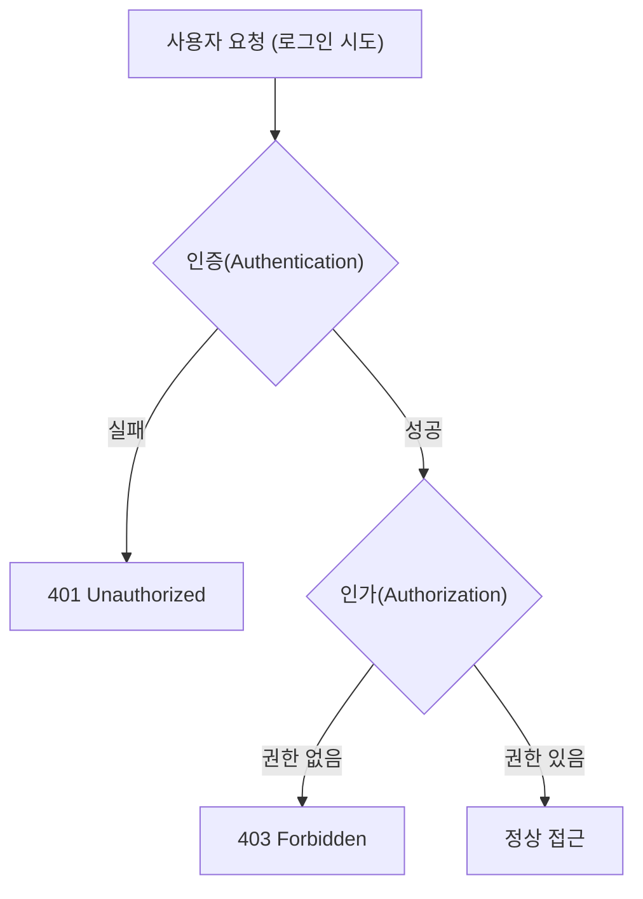

# 인증(Authentication)과 인가(Authorization)

---

## 0. 개요

* 인증(Authentication): “너는 누구냐?” → 사용자의 신원을 확인하는 과정
* 인가(Authorization): “너는 무엇을 할 수 있냐?” → 인증된 사용자의 권한을 확인하는 과정
* 순서: **인증 → 인가**
* 실패 시 상태 코드

  * 인증 실패 → `401 Unauthorized`
  * 인가 실패 → `403 Forbidden`

---

## 1. 인증(Authentication)

### 1-1. 정의

* 사용자가 주장하는 **신원(Identity)** 이 실제로 맞는지를 확인하는 절차

### 1-2. 주요 방법

* ID + Password
* OAuth (소셜 로그인)
* 2FA/MFA (OTP, 문자 인증 등)
* 생체인증 (지문, 얼굴 인식 등)

### 1-3. 인증 성공 후 동작

* 서버는 인증 성공 시 **세션(Session)** 또는 **JWT 토큰**을 발급
* 이 토큰은 이후 요청 시 “내가 인증된 사용자임”을 증명

---

## 2. 인가(Authorization)

### 2-1. 정의

* 인증된 사용자가 **어떤 자원(Resource)에 접근 가능한지** 확인하는 절차

### 2-2. 주요 방식

* **RBAC (Role-Based Access Control)** → 역할 기반 (admin, user 등)
* **ABAC (Attribute-Based Access Control)** → 속성 기반 (등급, 구독 상태 등)
* **정책 기반 제어** → 시간, IP, 네트워크 조건에 따른 접근 제한

### 2-3. 예시

* 로그인은 했지만 관리자 권한이 없어 `/admin` 접근 시 `403 Forbidden`

---

## 3. 인증 → 인가 전체 흐름

---

## 4. 세션(Session)과 JWT 비교

### 4-1. 세션(Session)

* 서버가 상태(State)를 직접 저장
* 로그인 성공 시 **세션 ID** 발급 → 쿠키에 저장

#### 4-1-1. 장점

* 서버에서 즉시 무효화 가능
* 브라우저가 쿠키 자동 전송
* 관리 직관적, 보안성 높음

#### 4-1-2. 단점

* 서버 확장 시 세션 동기화 필요
* CSRF 공격에 취약 (자동 전송 특성)
* Redis 같은 중앙 세션 저장소 필요

#### 4-1-3. 쿠키 보안 옵션

| 옵션       | 설명                |
| -------- | ----------------- |
| HttpOnly | JS 접근 차단 (XSS 방지) |
| Secure   | HTTPS에서만 전송       |
| SameSite | 크로스 도메인 제어        |

---

### 4-2. JWT (JSON Web Token)

* **무상태(stateless)** 인증 — 서버가 사용자 상태를 저장하지 않음
* 클라이언트가 `Authorization: Bearer <token>` 형태로 토큰 전송

#### 4-2-1. 장점

* 서버 확장성 높음 (스케일 아웃 구조에 유리)
* 마이크로서비스 간 인증 공유 용이
* 클라이언트 친화적 (웹/모바일 공통 사용 가능)

#### 4-2-2. 단점

* 탈취 시 위험 (즉시 무효화 어려움)
* 보안 설계 복잡 (토큰 저장, 만료, 회전 등)

#### 4-2-3. 보안 전략

* Access Token 짧게 (15~30분)
* Refresh Token 길게 (7~30일)
* 블랙리스트 or 버전 관리로 무효화 대응

---

### 4-3. 세션 vs JWT 비교 요약

| 항목    | **Session**    | **JWT**                |
| ----- | -------------- | ---------------------- |
| 상태 관리 | 서버 저장          | 무상태 (클라이언트 보관)         |
| 저장 위치 | 서버 (메모리/Redis) | 클라이언트 (Storage/Cookie) |
| 만료 제어 | 즉시 가능          | 불가능 (회전 필요)            |
| 확장성   | 낮음             | 높음                     |
| 주요 공격 | CSRF           | XSS                    |

---

## 5. 토큰(Token) 개념

### 5-1. 정의

* 인증/인가를 위해 발급되는 **문자열 형태의 인증 증명 수단**
* 일종의 “출입증”

### 5-2. 종류

| 종류           | 설명                                   |
| ------------ | ------------------------------------ |
| Basic Token  | `Base64(ID:PW)` 인코딩 (보안 낮음)          |
| Bearer Token | `Authorization: Bearer <token>` (표준) |

---

## 6. Access Token vs Refresh Token

| 구분   | **Access Token**   | **Refresh Token** |
| ---- | ------------------ | ----------------- |
| 역할   | API 접근 인증/인가       | Access Token 재발급  |
| 수명   | 짧음 (15~30분)        | 김 (7~30일)         |
| 저장   | 메모리 / localStorage | HttpOnly Cookie   |
| 탈취 시 | 위험도 높음 → 짧게 유지     | 재발급 제한 필요         |

### 6-1. 동작 흐름

1. 로그인 시 Access + Refresh Token 발급
2. Access Token으로 요청
3. 만료 시 Refresh Token으로 재발급
4. Refresh Token 만료 시 재로그인

---

## 7. 클라이언트 저장소 보안 비교

| 저장소                | 자동 전송 | JS 접근 가능          | 주요 보안 위험 | 권장 사용         |
| ------------------ | ----- | ----------------- | -------- | ------------- |
| **Cookie**         | ✅     | ❌ (HttpOnly 설정 시) | CSRF     | Refresh Token |
| **localStorage**   | ❌     | ✅                 | XSS      | Access Token  |
| **sessionStorage** | ❌     | ✅                 | XSS      | 탭 단위 임시 토큰    |

---

## 8. HTTP는 왜 무상태(Stateless)인가?

### 8-1. 이유

* 요청 간 상태를 저장하지 않음으로써

  * **확장성(Scalability)** 확보
  * **복원력(Fault Tolerance)** 강화
  * **로드밸런싱 및 수평 확장** 용이

### 8-2. 단점

* 로그인, 장바구니 등 “상태 유지” 기능은 별도 설계 필요
  → 세션/토큰으로 상태 보완

---

## 9. 세션 분산(Scalable Session) 전략

| 방식                        | 개념                | 장점       | 단점            |
| ------------------------- | ----------------- | -------- | ------------- |
| **Sticky Session**        | 동일 사용자를 항상 같은 서버로 | 간단       | 서버 장애 시 세션 유실 |
| **Session Replication**   | 서버 간 세션 복제        | 고가용성     | 네트워크 부하       |
| **Central Store (Redis)** | 중앙 세션 저장소 활용      | 확장성, 단순성 | 저장소 장애 리스크    |

---

## 10. 하이브리드 방식 (JWT + 저장소)

### 10-1. 개념

* JWT 발급 시 `jti(토큰 ID)`와 `tokenVersion`을 DB에 저장
* 요청 시 JWT 서명 + jti/version 검증
* 불일치 시 즉시 차단

### 10-2. 장점

* JWT의 무상태성과 세션의 제어성 결합
* MSA·분산 환경에서 실용적 균형
